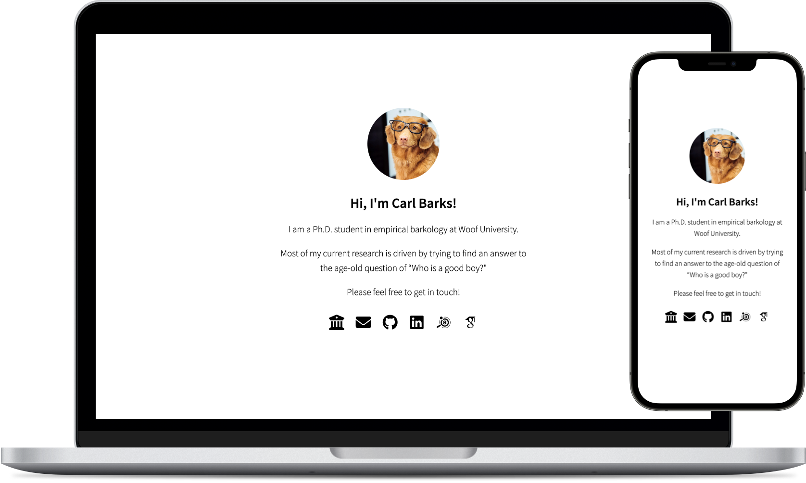

# minimal-academic-website

If you are an academic, **[you should have a website](https://kenworthy.space/advice.html#advpage)**. _Really._ It’s just frustrating and annoying if you are trying to google somebody because you have read their paper / seen their poster / some other reason, and want to get in touch, and you can’t even find an e-mail address.

This repository here is meant to help you get started by providing you with everything you need to have your own minimal website up and running in (hopefully) less than 10 minutes. It will look something like this:

<center>
  
</center>


## ⚡️Quickstart

1. This guide assumes that you will be hosting your website on [GitHub pages](https://pages.github.com). (Of course, the template also works if you are hosting the website somewhere else.) This means that, as a first step, you will need to [get a GitHub account](https://github.com/signup) if you do not have one already. Ideally, choose a somewhat “serious” username, as it will become part of your website’s URL.

2. Once you are signed into your GitHub account, create a new repository. Choose the following repository name:

   ```
   <your_github_username>.github.io
   ```

   Note: It needs to be *exactly* this pattern, otherwise it won’t work. The repository should be “Public”, and you might want to “Add a README file” so that you can clone the repository right away.

3. Clone the repository you have just created to your local machine:
   ```
   git clone git@github.com:<your_github_username>/<your_github_username>.github.io.git
   ```

4. Add the relevant files from _this_ repository (i.e., the `index.html`, `main.css`, `image.png`, `favicon.png`) to the copy of _your_ repository that you have just cloned.

5. Use a text editor of your choice to edit the `index.html` to match you, that is, add your name, a short description, relevant links (e.g., to your Google Scholar profile) and so on (see also below). Most of it should be pretty self-explanatory. Also, change the `image.png` to a picture of yourself. You should be able to preview all changes directly by opening the `index.html` in your browser.

6. Maybe add [a favicon](https://favicon.io/tutorials/what-is-a-favicon/). The code for this is already in the `<head>` section of the template; you only need to add a suitable `favicon.png` file. You can use, for example, [this online generator](https://favicon.io/) to create an icon with your initials or something like that.

7. Once you are happy with your changes, stage and commit your changes and push them to GitHub, using something like this:

   ```
   git add --all
   git commit -m "First commit"
   git push
   ```

8. That’s it! 🥳 Maybe you need to wait a few minutes for the changes to become active, but pretty soon your website should be available at `https://<your_github_username>.github.io`. (BTW, for some extra professionalism, it’s also pretty easy and cheap to set it up to use a custom domain, like, `yourname.com`.)


## ⚙️ Customization

This template is intentionally kept very minimalistic. Of course, you should feel to expand on it as much as you like. Most of the looks are controlled by the `main.css` file, so this would be a good starting point for changing things like, e.g., the color scheme or the fonts. Here are a few additional hints to get started:

* **Icons:** The icons to link to your social media profiles or other websites are based on [FontAwesome](https://fontawesome.com/) and [Academicons](https://jpswalsh.github.io/academicons/). Adding a new icon is pretty simple. For example, to add your ORCiD, you’d need this:

  ```
  <a href="link to orcid profile"><i class="ai ai-orcid"></i></a>
  ```

* **Fonts:** The easiest way to add fonts is to use [Google Webfonts](https://fonts.google.com/). Just pick a font that you like and it will tell you which bit of code you need to add to the `<head>` section of your `index.html`.

Ultimately, if you want are more complex website (e.g., with sub-pages, or a blog, or ...), but still keep the GitHub pages-based approach, you might want to look into static website generators such as [Jekyll](https://jekyllrb.com/) or [Hugo](https://gohugo.io).


## 🤓 Contributing

If you have any suggestions for improving this template (or the guide that explains how to use it), please feel free to open an issue or contribute a pull request!


## ⚖️  License

This template is released under a BSD 3-Clause License, see [LICENSE](https://github.com/timothygebhard/minimal-academic-website/blob/main/LICENSE) for more detailed information.

The [default favicon](https://github.com/timothygebhard/minimal-academic-website/blob/main/favicon.png) is taken from [Twemoji](https://twemoji.twitter.com/), who licensed it licensed under the [CC-BY 4.0](https://creativecommons.org/licenses/by/4.0/) license.
